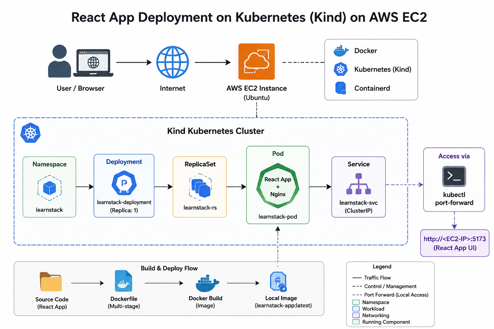
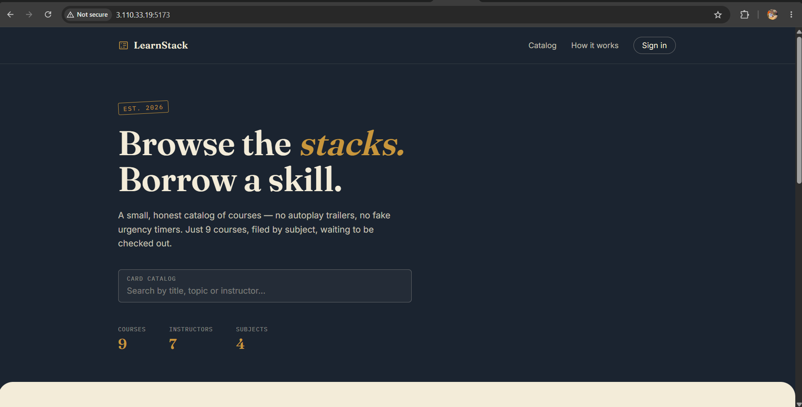
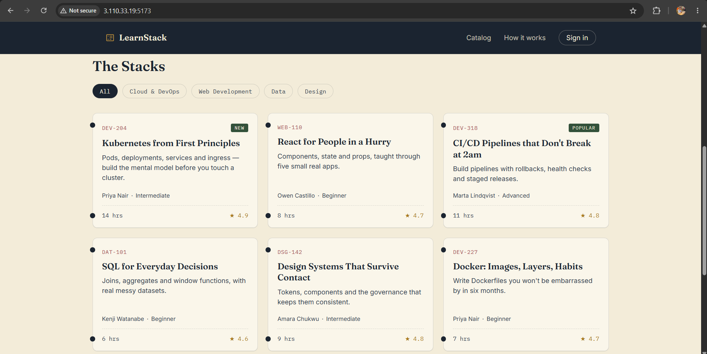

# 🚀 LearnStack Kubernetes Deployment on AWS EC2 using Kind

<p align="center">
  
</p>

<p align="center">
Deploying a React + Vite application with Docker, Nginx and Kubernetes (Kind) on an AWS EC2 Ubuntu instance.
</p>

---

## 📖 Project Overview

This project demonstrates how to deploy a production-style React application on a Kubernetes cluster created using **Kind (Kubernetes in Docker)** running on an **AWS EC2 Ubuntu instance**.

The application is first containerized using a multi-stage Docker build with Nginx, then deployed to Kubernetes using Deployment and Service manifests.

---

# 📸 Architecture

> Save your generated architecture image as:

```text
images/architecture.png
```

```text
User Browser
      │
      ▼
AWS EC2 (Ubuntu)
      │
      ▼
Docker
      │
      ▼
Kind Kubernetes Cluster
      │
 Namespace
      │
 Deployment
      │
 ReplicaSet
      │
 Pod (React + Nginx)
      │
 ClusterIP Service
      │
kubectl port-forward
      │
      ▼
Browser
```

---

# 🖼️ Output Screenshots

Save your screenshots as:

```
images/home.png
images/catalog.png
images/architecture.png
images/steps.jpg
```

## Home Page



---

## Course Catalog



---

## Architecture Diagram


---

## Deployment Steps Notes


---

# 🛠️ Tech Stack

- React
- Vite
- Docker
- Nginx
- Kubernetes
- Kind
- AWS EC2
- Ubuntu
- kubectl

---

# 📂 Project Structure

```text
LearnStack-Kubernetes
│
├── src
├── public
├── Dockerfile
├── nginx.conf
├── package.json
├── k8s
│   ├── namespace.yaml
│   ├── deployment.yaml
│   └── service.yaml
└── README.md
```

---

# ☁️ EC2 Setup

## Connect

```bash
chmod 400 jenkins.pem
ssh -i jenkins.pem ubuntu@<EC2-PUBLIC-IP>
```

---

## Update Ubuntu

```bash
sudo apt update
sudo apt upgrade -y
```

---

# 🐳 Install Docker

```bash
sudo apt install docker.io -y
docker --version
sudo usermod -aG docker $USER
newgrp docker
docker ps
```

---

# ☸️ Install Kind

```bash
curl -Lo ./kind https://kind.sigs.k8s.io/dl/v0.32.0/kind-linux-amd64
chmod +x kind
sudo mv kind /usr/local/bin/
kind version
```

---

# ☸️ Install kubectl

```bash
curl -LO "https://dl.k8s.io/release/$(curl -L -s https://dl.k8s.io/release/stable.txt)/bin/linux/amd64/kubectl"

chmod +x kubectl
sudo mv kubectl /usr/local/bin/
kubectl version --client
```

---

# ☸️ Create Kind Cluster

cluster.yml

```yaml
kind: Cluster
apiVersion: kind.x-k8s.io/v1alpha4

nodes:
- role: control-plane
- role: worker
- role: worker
- role: worker
```

```bash
kind create cluster --config cluster.yml --name my-cluster
kubectl get nodes
```

---

# 🐳 Build Docker Image

```bash
docker build -t learnstack-app:latest .
```

Run locally

```bash
docker run -d --name learnstack -p 5173:80 learnstack-app:latest
```

---

# 📦 Push Image

```bash
docker login
docker tag learnstack-app:latest <dockerhub-username>/learnstack-app:latest
docker push <dockerhub-username>/learnstack-app:latest
```

---

# ☸️ Kubernetes Deployment

## Namespace

```bash
kubectl apply -f k8s/namespace.yaml
```

## Deployment

```bash
kubectl apply -f k8s/deployment.yaml
```

## Service

```bash
kubectl apply -f k8s/service.yaml
```

---

# ✅ Verification

```bash
kubectl get all -n learnstack

kubectl get pods -n learnstack

kubectl get svc -n learnstack
```

---

# 🌐 Port Forward

```bash
kubectl port-forward service/learnstack-svc \
-n learnstack \
5173:80 \
--address=0.0.0.0
```

Visit

```
http://<EC2-PUBLIC-IP>:5173
```

---

# 📋 Commands Summary

```bash
docker build -t learnstack-app:latest .

docker run -d --name learnstack -p 5173:80 learnstack-app:latest

docker login

docker push <dockerhub>/learnstack-app:latest

kubectl apply -f namespace.yaml

kubectl apply -f deployment.yaml

kubectl apply -f service.yaml

kubectl get all -n learnstack

kubectl port-forward service/learnstack-svc \
-n learnstack \
5173:80 \
--address=0.0.0.0
```

---

# 🛠️ Troubleshooting

- Docker permission denied → `newgrp docker`
- ImagePullBackOff → Push image to Docker Hub
- Port already allocated → Remove old container
- Connection refused → Check Security Group
- Service not reachable → Verify `kubectl get svc`

---

# 🎯 Learning Outcomes

- Docker Multi-stage Build
- Nginx Container
- Kubernetes Deployment
- Namespace
- ReplicaSet
- Pods
- ClusterIP Service
- Port Forwarding
- AWS EC2
- Kind Cluster
- kubectl

---

# 👨‍💻 Author

**Rameshwar Mane**

- MERN Stack Developer
- DevOps Enthusiast
- AWS Certified Cloud Practitioner

If this project helped you, consider ⭐ starring the repository.
